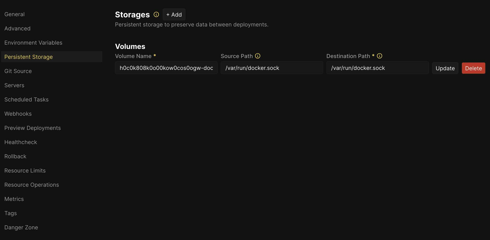

# Coolify Docker Statuses

A monitoring tool for tracking and reporting Docker container status changes in Coolify-managed environments. This 
service watches containers with specific Coolify labels and sends webhook notifications when container statuses change.

## Features

- Monitors Docker containers managed by Coolify
- Tracks container status changes (running, stopped, exited, etc.)
- Filters containers based on Coolify project and environment names
- Sends real-time webhook notifications on status changes
- Configurable monitoring interval

## Installation

### In Coolify

Create a new application from a public repository with the HTTPS URL of this repository.

In the `Persistent Storage` section of the Coolify application, mount the Docker socket from the host's 
`/var/run/docker.sock` to `/var/run/docker.sock` in the container like the screenshot below:



Next, configure the environment variables in the `Environment Variables` section of the Coolify application according 
to the remaining sections in this README.

### Using Docker

```bash
docker build -t coolify-docker-statuses .

docker run -d \
  -v /var/run/docker.sock:/var/run/docker.sock \
  -e STATUS_CHANGE_WEBHOOK_URL=https://your-webhook-url.com \
  -e COOLIFY_PROJECT_NAME=your-project \
  -e COOLIFY_ENVIRONMENT_NAME=production \
  -e COOLIFY_MONITOR_LABEL=coolify.managed \
  -e DOCKER_SOCKET=/var/run/docker.sock \
  coolify-docker-statuses
```

Or

```bash
docker build -t coolify-docker-statuses .

docker run --rm coolify-docker-statuses \
  --status-change-webhook-url=https://your-webhook-url.com \
  --coolify-project-name=your-project \
  --coolify-environment-name=production \
  --coolify-monitor-label=coolify.managed \
  --docker-socket=/var/run/docker.sock
```

### Using Python (Development)

```bash
# Clone the repository
git clone https://github.com/sleek-inc/coolify-docker-statuses.git
cd coolify-docker-statuses

# Install dependencies
rye sync

# Activate virtualenv
. .venv/bin/activate

# Run the application
cs
```

## Configuration

The application can be configured using environment variables or command-line arguments.

### Environment Variables

| Variable                    | Description                                    | Default | Required |
|-----------------------------|------------------------------------------------|---------|----------|
| MONITOR_INTERVAL_IN_SECONDS | Interval between status checks (in seconds)    | 5       | No       |
| DOCKER_SOCKET               | Docker socket path                             | n/a     | Yes      |
| STATUS_CHANGE_WEBHOOK_URL   | URL to send webhook notifications to           | n/a     | Yes      |
| COOLIFY_MONITOR_LABEL       | Label to identify containers to monitor        | n/a     | Yes      |
| COOLIFY_PROJECT_NAME        | Project name to filter containers              | n/a     | Yes      |
| COOLIFY_ENVIRONMENT_NAME    | Environment name to filter containers          | n/a     | Yes      |

These variables can be set in a `.env` file or passed as environment variables to the container.

## How It Works

The service connects to the Docker daemon and monitors containers that have specific Coolify labels. It periodically 
checks the status of these containers and detects any changes. When a container's status changes (e.g., from "running" 
to "exited"), it sends a webhook notification to the configured URL.

### Container Filtering

Containers are filtered based on three criteria:
1. They must have the Coolify monitor label (default: `coolify.managed=true`)
2. They must match the specified Coolify project name (`coolify.projectName=your-project`)
3. They must match the specified Coolify environment name (`coolify.environmentName=production`)

## Webhook Notifications

When a container's status changes, a POST request is sent to the configured webhook URL with a JSON payload containing 
details about the change.

### Webhook Payload Schema

```json
{
  "event_type": "container_status_change",
  "timestamp": "2023-05-01T12:00:00+00:00",
  "container": {
    "id": "container_id_string",
    "name": "container_name",
    "image": "image:tag",
    "labels": {
      "label1": "value1",
      "label2": "value2"
    },
    "created": "2023-05-01T10:00:00Z",
    "error": null
  },
  "previous_status": "RUNNING",
  "current_status": "EXITED"
}
```

#### Payload Fields

| Field            | Description                                           |
|------------------|-------------------------------------------------------|
| event_type       | Always "container_status_change"                      |
| timestamp        | ISO8601 timestamp when the status change was detected |
| container.id     | Docker container ID                                   |
| container.name   | Container name                                        |
| container.image  | Container image with tag                              |
| container.labels | Container labels as key-value pairs                   |
| container.created| Container creation timestamp                          |
| container.error  | Error message (if any)                                |
| previous_status  | Previous container status                             |
| current_status   | New container status                                  |

### Possible Status Values

- UNKNOWN
- CREATED
- RUNNING
- RESTARTING
- EXITED
- PAUSED
- DEAD
- REMOVING

## License

[MIT License](LICENSE)
